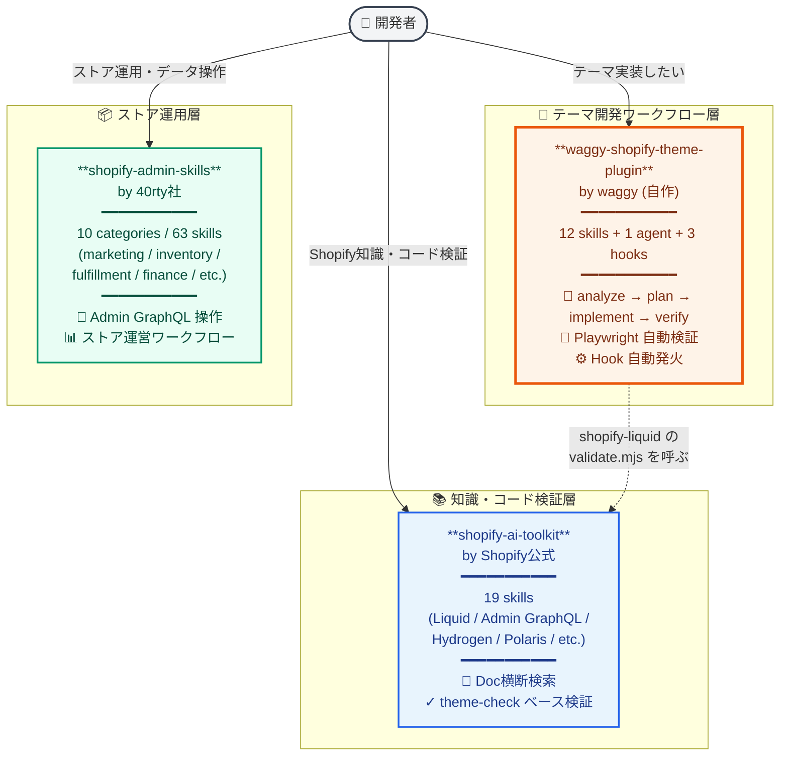
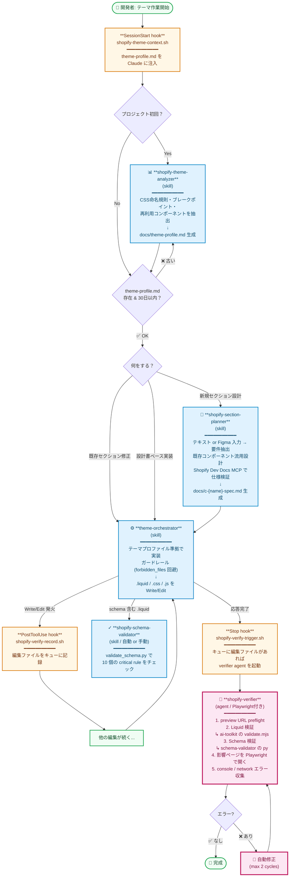
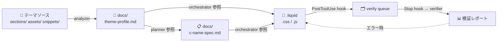

# Shopify Plugin Ecosystem & Theme Workflow

waggy-shopify-theme-plugin の位置づけと、テーマ開発ワークフローを可視化するドキュメント。

---

## 1. Shopify 関連 Plugin の棲み分け

Claude Code 環境でインストールされている 3 つの Shopify 関連 plugin の役割マップ。

### 役割対比表

| 観点 | shopify-ai-toolkit | **waggy-shopify-theme-plugin** | shopify-admin-skills |
|------|-------------------|-------------------------------|---------------------|
| **メタファー** | 📚 司書 | 🔨 大工の親方 | 📦 ストア店長補佐 |
| **提供元** | Shopify公式 | waggy (自作) | 40rty社 |
| **対象タスク** | API設計・GraphQL・Liquid記法・ドキュメント検索 | テーマ実装ワークフロー丸ごと | ストア運営・在庫・受注・顧客管理 |
| **発火モード** | 受動的（呼ばれた時だけ） | **能動的**（hook で自動起動） | 受動的（呼ばれた時だけ） |
| **構成** | 19 skills | 12 skills + 1 agent + 3 hooks | 63 skills (10 categories) |
| **言語** | 英語 | **日本語** | 英語 |
| **依存** | スタンドアロン | **shopify-ai-toolkit に依存**（validate.mjs を呼ぶ） | スタンドアロン |
| **得意領域** | 知識・公式仕様・lint | テーマ実装 + 検証 + 自動化 | Admin API 経由のストア操作 |
| **不得意領域** | Playwright 検証なし、自動化なし | API設計・Admin GraphQL の知識 | テーマ開発 |

### いつどれを使うか

| やりたいこと | 使う Plugin |
|-------------|------------|
| Liquid タグの正しい使い方を調べる | **shopify-ai-toolkit** (`shopify-liquid`) |
| Admin GraphQL でクエリ書く | **shopify-ai-toolkit** (`shopify-admin`) |
| テーマのセクション新規作成 | **waggy** (`shopify-theme-analyzer` → `shopify-section-planner` → `theme-orchestrator`) |
| Liquid 編集後の自動検証 | **waggy** (Stop hook → `shopify-verifier`) |
| 在庫一括更新・キャンペーン設定 | **shopify-admin-skills** |
| 顧客の cohort 分析・LTV 集計 | **shopify-admin-skills** |

---

## 2. waggy-shopify-theme-plugin 主要ワークフロー（analyze → plan → implement → verify）

開発者が `.liquid` セクションを 1 つ作るときの自動化フロー。図は 13 スキルのうちコアパイプライン（analyzer → planner → orchestrator → schema-validator）と検証系 Hook / Agent の連携を示す。図に含まれない 9 スキル（store-bootstrap / theme-init / ds-component-search / asset-harvest / theme-brand-layer / flow-builder / cv-tracking / delivery-report / cli-auth）は後述の「コンポーネント早見表」を参照。

### コンポーネント早見表

| 種類 | 名前 | 起動契機 | 役割 |
|------|------|---------|------|
| **Hook** | `shopify-theme-context.sh` | SessionStart | プロジェクトのテーマ情報を Claude に注入 |
| **Hook** | `shopify-verify-record.sh` | PostToolUse (Write/Edit) | 編集ファイルをキューに記録 |
| **Hook** | `shopify-verify-trigger.sh` | Stop | キューに編集があれば verifier 起動 |
| **Skill** | `shopify-theme-init` | 明示呼び出し | プロジェクト構造・ignore 整備、ゴミ整理（analyzer の前段） |
| **Skill** | `shopify-theme-analyzer` | 明示呼び出し | テーマ全体分析 → `theme-profile.md` |
| **Skill** | `shopify-section-planner` | 明示呼び出し | 新規セクション設計書作成 |
| **Skill** | `theme-orchestrator` | 明示呼び出し | 実装オーケストレーション |
| **Skill** | `shopify-ds-component-search` | orchestrator Phase 0 から自動 / 明示 | 既存 `c-*` 資産・Figma Components・中央ライブラリの洗い出し |
| **Skill** | `shopify-asset-harvest` | 実装完了時に orchestrator が提案 / 明示 | 実装資産を汎用化して案件横断ライブラリへ回収（ds-component-search と対） |
| **Skill** | `shopify-schema-validator` | 自動 or 明示 | schema 構文 10 ルール検証 |
| **Skill** | `shopify-theme-brand-layer` | 明示呼び出し | Brand 層（`brand-*`）の設計・実装（横断スキル） |
| **Skill** | `shopify-flow-builder` | 明示呼び出し | Shopify Flow 構築（テーマ開発とは別軸） |
| **Skill** | `shopify-cv-tracking` | 明示呼び出し | CV 計測タグ / カスタムピクセルの実装と検証（別軸） |
| **Skill** | `shopify-delivery-report` | 明示呼び出し / 実装完了時 | クライアント向け報告文生成 + 実績記録（別軸） |
| **Skill** | `shopify-cli-auth` | 明示呼び出し | Shopify CLI v4 のアカウント切替・認証・ストア固定（別軸） |
| **Skill** | `shopify-store-bootstrap` | 明示呼び出し | 新案件立ち上げのフルセットアップ（theme-init / analyzer を内包する上位オーケストレーター） |
| **Agent** | `shopify-verifier` | Stop hook 経由 | Liquid + Playwright 自動検証 |

### 設計原則

1. **単一責任** — 各 skill は 1 つの明確な仕事だけ持つ（analyzer は読むだけ、planner は書くだけ、orchestrator は実装するだけ、validator は検証するだけ）
2. **独立実行** — フローを途中から呼べる。`/theme-orchestrator` だけでも、`/shopify-section-planner` だけでも使える
3. **コンテキスト効率** — 重い分析結果は `theme-profile.md` にシリアライズ、後続スキルは読むだけ
4. **責務分離** — Skill = ユーザー発火 / Hook = ランタイム発火 / Agent = Hook → 隔離プロセス
5. **配布前提** — リポジトリは PUBLIC で第三者が使う。個人情報・マシン固有パス・私物ファイル（`~/.claude/rules/` や個人 memory）への依存をスキルに書かない。既定値は実行者の環境（`git config` / `gh auth status` / 環境変数 / memory の grep 探索）から導出し、個人の慣例は各実行者の memory 側に置く。リリース前チェックは `docs/release-checklist.md` の配布前提チェックで機械的に検出する

---

## 3. データの流れ（補足）

---

## 関連ドキュメント

- [README.md](../README.md) — プラグインの概要・インストール・コマンド一覧
- 各 skill の SKILL.md — `skills/{skill-name}/SKILL.md`
- [shopify-verify.config.json](../README.md#shopify-verifyconfigjson) — プロジェクト固有設定（preview URL、viewport、forbidden_files）
